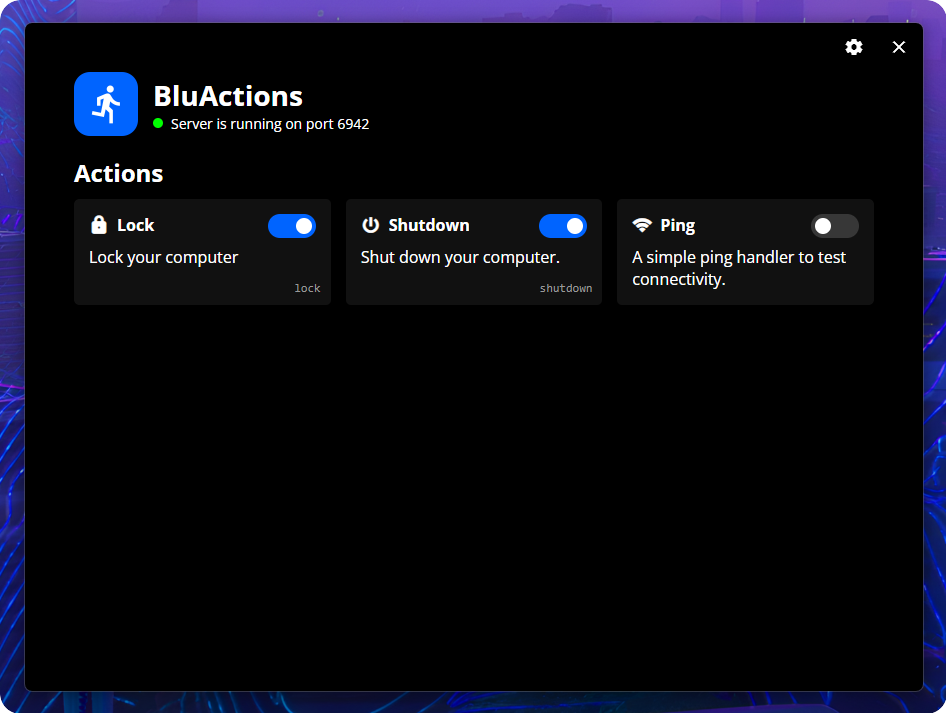
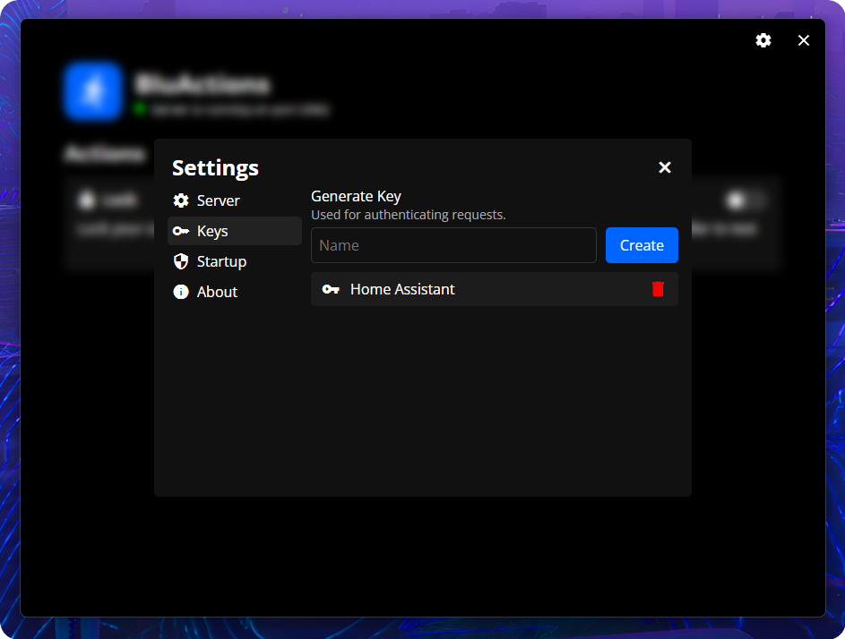
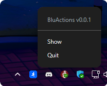

# BluActions

Control your PC using a customizable and secure REST API!



## Features

- Guided setup process to get you up and running with the app
- Easily enable/disable actions available via the API
- Secure access with API keys
- Runs in the background (can be automatically started in the tray)

Useful for controlling your PC using automations, for example using Home Assistant to lock or turn off your computer.

## Getting started

The application only works on Windows for now, support for other platforms is coming in the future!

1. Download BluActions from [Releases](../../releases/).
2. Open the downloaded file to install
3. Open BluActions and follow the instructions to set up the server!

## Usage

### Overview

The initial page of BluActions ([see above](#bluactions)) shows the current internal server status, as well as an overview of all available actions. You can easily enable/disable actions here to customize which actions can be ran using the API.

### Running Actions

The API is very simple:

`http://<ip-address>:<port>/api/<handler>?key=<generated-key>`

- Any method is supported (`GET`, `POST`, etc.)
- Replace `<ip-address>` and `<port>` with your computers IP address and your custom port
- Replace `<handler>` with the ID of the action you want to run (shown in the bottom right of the action in the overview)
- Replace `<generated-key>` with the key you generated during setup or in `Settings -> Keys`

Alternatively, the key can be supplied using headers:

```
Authorization: <generated-key>
```

### Settings



Here you can adjust how BluActions behaves. You can choose what port the server runs on, generate keys, or choose if the app will automatically start with your computer, whether it will start minimized to the system tray, and more.

### Tray icon

BluActions will for the most part live in your system tray. Right-click it to bring up the menu, where you can open or quit BluActions. You can also just click the tray icon once to open BluActions.



## Contributing

Contributions are very welcome! Make sure to follow the guidelines laid out in [CONTRIBUTING.md](CONTRIBUTING.md).

## Support

Having issues with the app? Feel free to open issues in this repository, or join [my discord server](https://discord.bludood.com) for further support.
